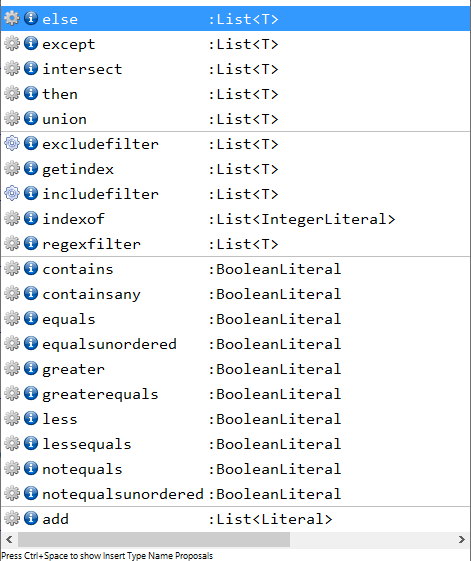

# ch.actifsource.example.selector
In this project we will show to use the selector operations.

Operations to use inside the selector:

Example selector:

## Requirements
Actifsource  Workbench Community Edition

## License
[http://www.actifsource.com/company/license](http://www.actifsource.com/company/license)